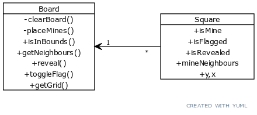
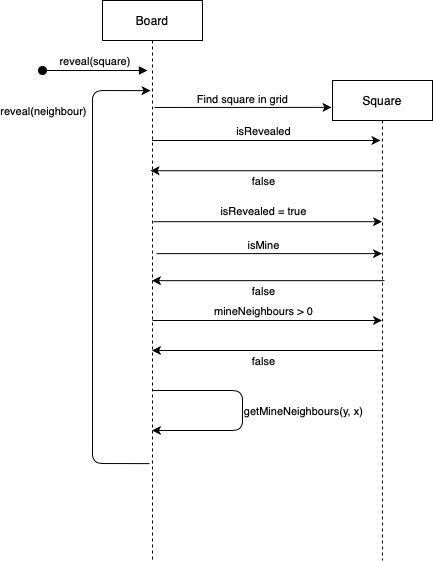

# Architecture

The application consists three packages: a main package, whose only purpose is to launch a JavaFX app from the UI package that then creates a Board instance from the game package.

The game logic is handled by the Board class, and the information of individual Squares of the board is stored in instances of the Square class/struct:

The main functionality is the ability to reveal squares on the board by clicking them. The process of revealing a "0" square is shown in the following sequence diagram:
