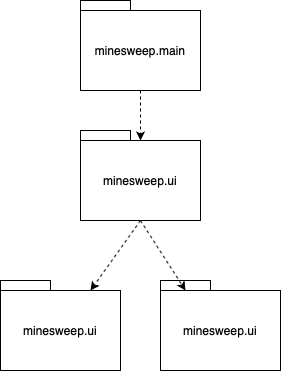
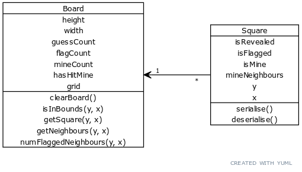
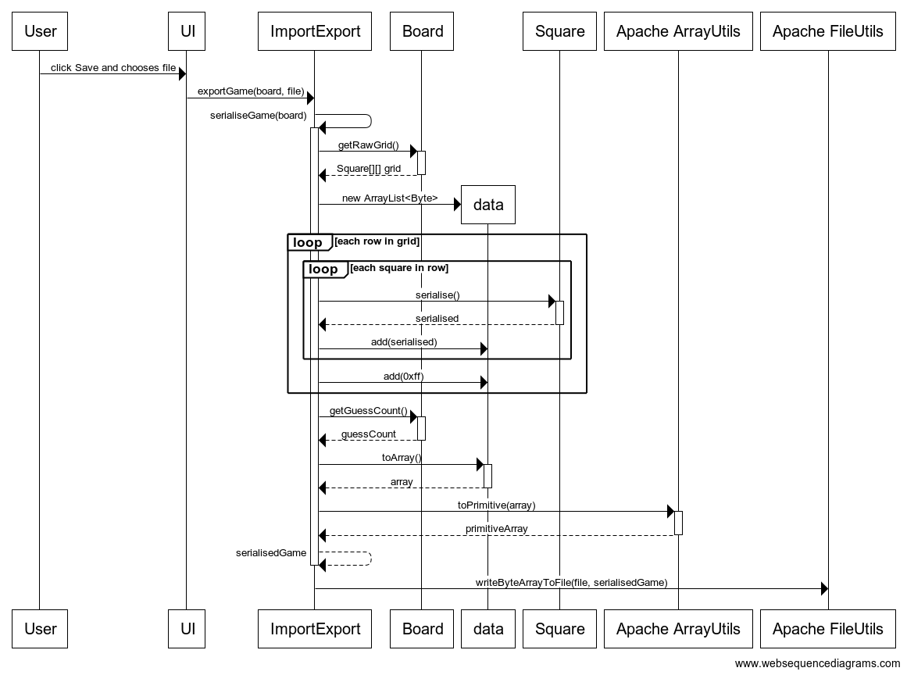

# Architecture

## Structure
The application consists of four packages:
1. The Main package, whose only responsibility is to lauch the UI from the UI package.
2. The Game package, which holds classes that keep track of game state and handle the game logic.
3. The DAO package, which holds a class with static methods to de/serialise games and read/write them to/from files.
4. The UI package, which renders the visible window from the game state and passes clicks to the game logic class and interfaces with the DAO package to save/load games.

The package structure is as follows:


## User Interface
The user interface consists of a single view, where a menubar is displayed at the top to display buttons for the import/export functionality, the currently ongoing game grid is displayed in the middle, and a form for creating a new game is at the bottom.

The UI is created programatically (as opposed to FXML) and the more complex parts (e.g. game grid squares and the fading win/lose overlay) reside in their own classes in the package — the main JavaFX app is in `minesweep.ui.MinesweepUI.java`.

The UI only creates instances of the `minesweep.game.GameLogic` class, and doesn't itself handle any kind of game logic or state. The rendered game squares (from the `minesweep.ui.SquareUI` class) listen for click events and merely call the `GameLogic` methods. After each method call, the UI is re-rendered from the `GameLogic` state.

## Logic
The actual game logic is handled by the `minesweep.game.GameLogic` class with the `Board` and `Square` classes from the same package mostly holding state and exposing getters, setters, and selectors.

The relationship between the state-holding `Board` and `Square` classes is as follows:


The `Square` class has an instance method `serialise` that returns a byte-representation of the object and a static `deserialise` that creates a new instance of `Square` from a byte.

The `GameLogic` handles e.g. modifying the `Board` `grid` when the UI calls its `guess` method. It also provides the necessary setters for the `ImportExport` class to create an extact `Board` instance from save game data.

## Save game data format
The `minesweep.dao.ImportExport` class exposes two static methods: `importGame` and `exportGame`. The UI calls these methods when the user clicks the corresponding menu items and chooses a file using the system's file chooser dialog.

As discussed previously, the `minesweep.game.Square` class exposes methods to de/serialise individual `Square`s, which `ImportExport` uses to decide the bytes to write. Each Square has four fields that need to be serialised for saving (the coordinates are implicitly saved by the Squares position in the save data):
1. `boolean` `isRevealed`
2. `boolean` `isFlagged`
3. `boolean` `isMine`
4. `int` `mineNeighbours` (0–8)

Since the `mineNeighbours` field can only have values 0–8, it will fit into four bits. The boolean values naturally fit each into one bit. Thus each square can naturally be serialised into seven bits.

The save game is built by listing each row of the grid (from top to bottom and left to right), serialising each Square and marking the end of a row with the byte `0xff`, thus creating a 1D byte array, i.e. a file.

Since each game also keeps track of the guesses made, that number is stored in a byte at the last position of the data.

An example of a serialised 4x4 game with no mines and no revealed squares with 5 guesses made would look like:
```
00 00 ff
00 00 ff
05
```

The exporting process as a sequence diagram:


## Known faults

### UI
Just like with the example Todo project, this game's UI is also created programatically and is mostly so-called spaghetti code: the event handlers are written alongside the rendring logic, and it's a nightmare to make sense of. Some of the more complex elements of the UI have been factored into their own classes, but the UI code could be broken up more.

The UI doesn't adapt very well to larger board sizes — depending on the resolution of the monitor, the window will often clip out out bounds. To remedy this, the square sizes should probably dynamically resize to fit whatever window size they're contained in.

### Game Logic
The board generation algorithm isn't very sofisticated and will hang if asked to generate a board with too many mines, since it just picks a random spot on the board and tries to place a mine there; if most of the board is mines already, it'll take a long time until a free spot is chosen. A better algorithm would probably place mines randomly at the start, and then move them out of the first guess's way as necessary.

### DAO
The import/export is written to work with Java's File class only, and would need to be refactored to support e.g. cloud saves.