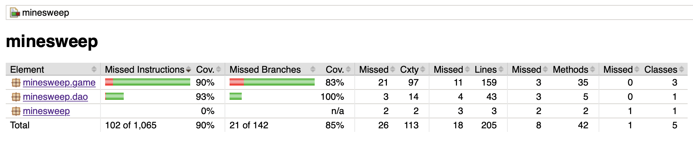

# Testing

## Unit testing
The unit testing is done with JUnit. All three game logic classes and the import/export class have tests, while the ui doesn't.

The `Board` and `Square` classes are pretty thoroughly tested as a side product of the tests for the `BoardLogic` class that depends on them. Nevertheless, both have their own unit tests too: the `Board` tests check for edge cases in its helper methods and the `Square` tests check its de/serialisation behavior, since `Square`'s function out of that context is that of a struct.

The `BoardLogic` is checked with a pre-generated sample game for correct behaviour (e.g. that it respects the constructor-given board dimensions, that guess count is incremented after each guess etc).

The `ImportExport` class is tested, again with a pre-generated game, for correct de/serialisation, but its filesystem IO is left out of unit tests. This would require using JUnit's `TemporaryFolder`s.

The test coverage for instructions is 90% and 85% for branches:

## System testing
The application .jar's been manually tested on MacOS Big Sur v11.1 running Java 11.0.9 and deemed to behave as expected when following the [user manual](./user-manual.md).

## Known faults
The error dialogs shown to the user when e.g. a file could not be read aren't as clear as they could be — they consist of the fault (e.g. "Game could be created" when the import process fails) and Java's internal error message.