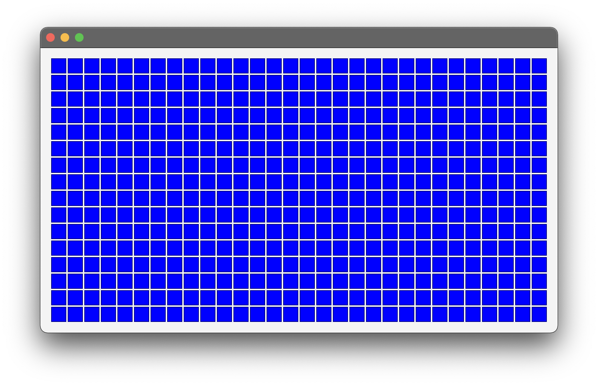
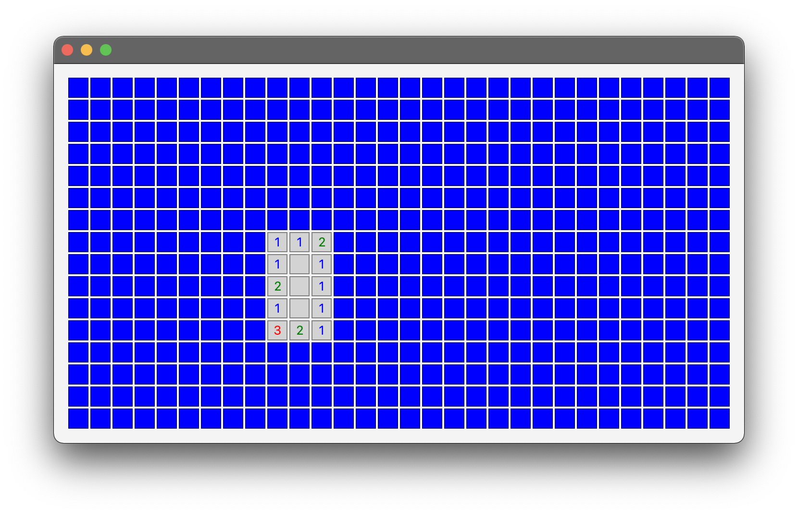
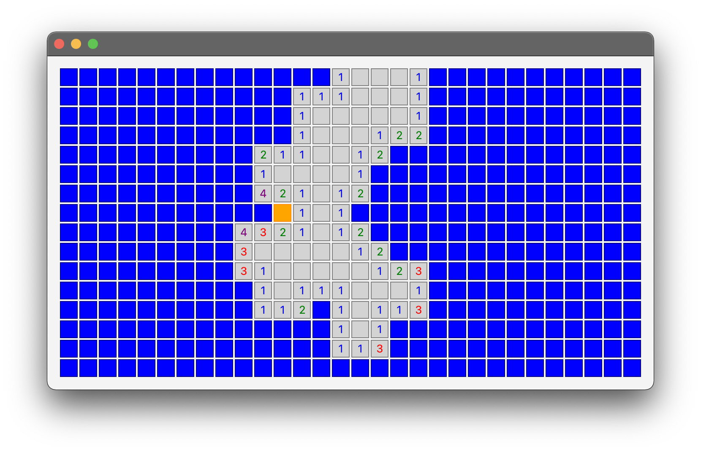
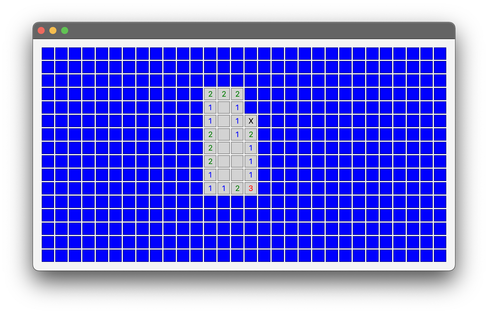

# User manual

Download the [latest released .jar file](https://github.com/emsknock/minesweep/releases).

Run the application with
```bash
$ java -jar <path to downloaded file>
```

The application will start to a new game, shown below. The only difficulty available at the moment is hard (a 30x16 grid with 99 mines):


Click a square to reveal it — the first square is as of yet not guaranteed to be safe, so you might lose on your first guess:


Click some more squares until you are ready to "flag" some squares as known mines. You can do this by right-clicking a square — it'll turn orange:


Hit mines show up as black crosses:
