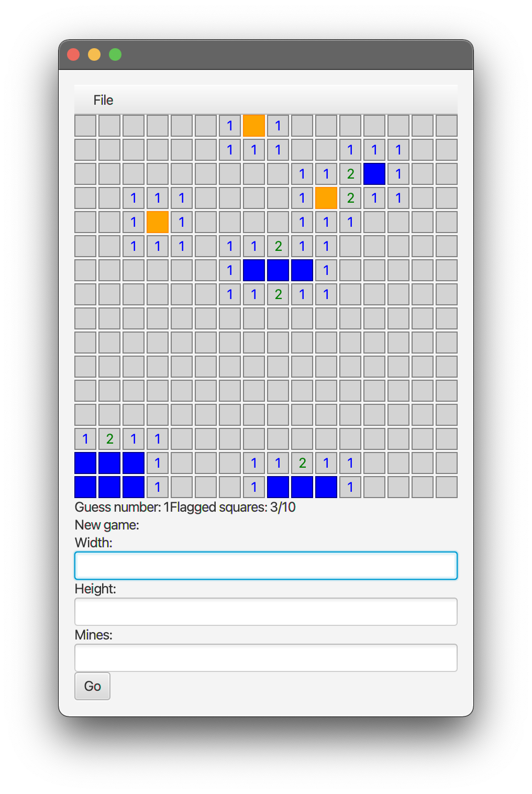

# User manual

* [Install and run](#install-and-run)
* [Basic controls](#basic-controls)
* [Creating a new game](#creating-a-new-game)
* [Saving and loading games](#saving-and-loading-games)

## Install and run
1. Download the [latest released .jar file](https://github.com/emsknock/minesweep/releases).
2. Run the application with
    ```bash
    $ java -jar <path to downloaded file>
    ```

## Basic controls
The application will start with a new 16x16 game with 16 mines.


Click a square to start.


Flag squares by right clicking on them. Right click again to unflag.


To speed things up you can click on already revealed squares to reveal all their neighbours. To protect you from accidentally hitting mines, however, this only works when the square has the amount of flagged neighbours corresponding to its value. For example, you could click the circled "2" in the centre of the field to reveal the square next to it but not the circled "1" in the top right (unless you flag either one of the squares above it to bring its flagged neighbour count to one).


When you have identified all the mines correctly, i.e. all mine squares are flagged and all safe squares are unflagged, the game will tell you you've won.


If you hit a mine, the game will end and the game tells you that you've lost.


## Creating a new game
To create a new game, give a width and height and an amount of mines to place and click "go". The maximum amount of mines to place is `width * height - 9`. Please note that the maximum **recommended** amount is `(width * height) / 2`, since densly packed minefields might take **a long time to generate** and aren't very interesting to play.


## Saving and loading games
To save and load games, click the `File > Save` and `File > Load` menus and follow your system's file chooser dialog. The save file name or file extension doesn't matter.
